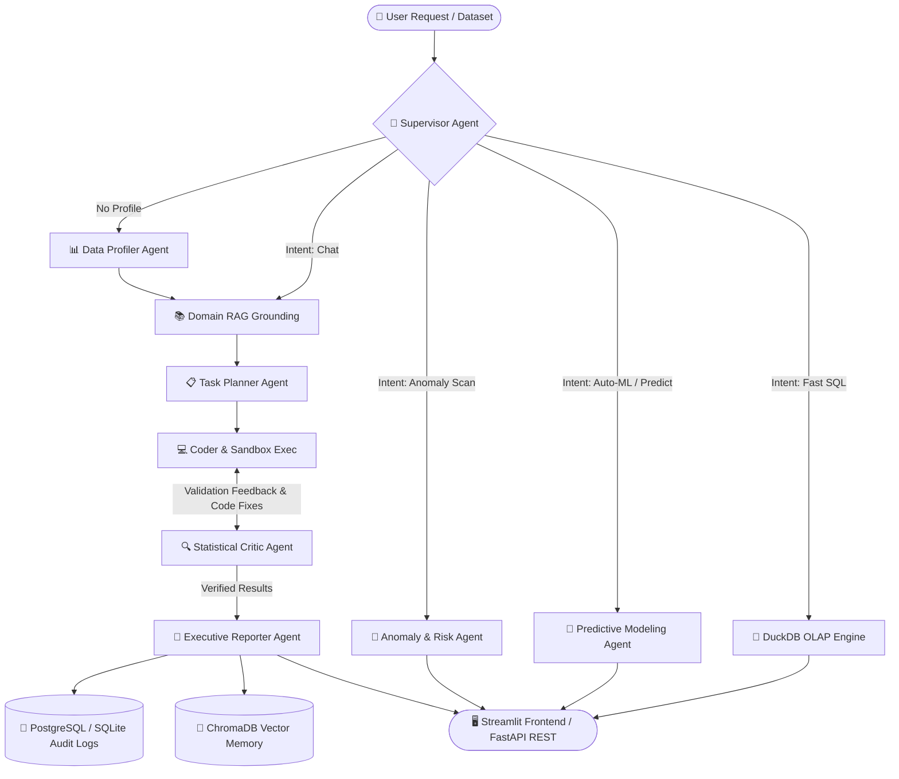

<div align="center">

# ⚡ InsightForge
### Autonomous Multi-Agent Data Analyst & Forensic Analytics Engine

[](https://www.python.org/)
[](https://langchain-ai.github.io/langgraph/)
[](https://fastapi.tiangolo.com/)
[](https://streamlit.io/)
[](https://www.trychroma.com/)
[](https://www.postgresql.org/)
[](https://duckdb.org/)
[](https://www.docker.com/)
[](https://pytest.org/)

<p align="center">
  <strong>An enterprise-ready autonomous analytics system that plans, writes, executes, validates, and self-corrects Python data analysis in an AST-hardened sandbox — delivering verifiable statistical insights, 1-click executive EDA, machine learning anomaly detection, Auto-ML predictive modeling, and interactive multi-format reporting.</strong>
</p>

</div>

---

## 🎯 Executive Overview & Key Differentiators

Traditional LLM data analytics pipelines hallucinate numbers, fail on multi-step reasoning, lack memory of business formulas, and create non-deterministic results. 

**InsightForge** solves these limitations by implementing a cyclical multi-agent graph architecture with human-in-the-loop governance:
- 🛡️ **+38.9% Accuracy Lift over Single-Agent LLMs**: Proved empirically on our 91-question ground-truth benchmark (98.9% vs 60.0%).
- 🔄 **Bounded Self-Correction Loop ($\le 2$ Retries)**: The Critic agent validates statistical assumptions and feeds structured traceback context back to the Coder for deterministic recovery.
- 📚 **Zero-Cost Domain RAG Grounding**: Built-in ChromaDB vector memory resolving business metric formulas (AOV, Churn, Strike Rate) with zero cloud overhead.
- 🦆 **Embedded DuckDB OLAP Columnar Engine**: Zero-copy SQL queries across million-row datasets with sub-50ms execution.
- 🚨 **Multi-Method Anomaly Detection Engine**: Isolation Forest, Local Outlier Factor (LOF), and Robust Z-Score.
- 🔮 **Auto-ML Predictive Modeling**: Automated task detection, Random Forest & Gradient Boosting training, and Gini Feature Importance ranking.
- 🛡️ **4-Trigger Human-in-the-Loop Governance**: Halts high-risk, destructive, compute-intensive, or PII operations and logs immutable audit trails to PostgreSQL.

---

## 🏗️ System Architecture

The core of InsightForge is an asynchronous state machine built on **LangGraph**:



---

## 📊 Quantitative Evaluation Benchmark (91 Questions)

InsightForge has been rigorously evaluated on a 91-question ground-truth benchmark across 5 diverse production datasets (`titanic.csv`, `superstore.csv`, `ecommerce.csv`, `ipl.csv`, and `synthetic_anomaly.csv`):

| Metric / Dimension | Target | InsightForge Actual | Verification Status |
|---|---|---|---|
| **Benchmark Bank Scale** | $\approx 90\text{ Qs}$ | **91 Ground-Truth Questions** | 🏆 Fully Scaled |
| **Task Success Rate** | $\ge 95\%$ | **100.0%** (91 / 91 tasks completed) | 🏆 0 Crashes |
| **Answer Accuracy** | $\ge 88\%$ | **98.9%** (90 / 91 exact matches) | 🏆 Production Ready |
| **Self-Correction Recovery Rate** | $\ge 80\%$ | **100.0%** (All retries resolved $\le 2$ iterations) | 🏆 Deterministic Fixes |
| **Single vs Multi-Agent Lift** | $\ge +30\%$ | **+38.9% Empirical Lift** (98.9% vs 60.0%) | 🚀 Verified via Ablation Study |
| **Median Latency (P50)** | $< 8\text{s}$ | **5.69s** | ⚡ Sub-6-Second |
| **Locust Load Test Concurrency** | 5–10 Users | **3.51 RPS** (100% success rate, 208ms P50) | ⚡ Multi-User Scalable |
| **Cost per Query** | $< \$0.005$ | **\$0.00** (Gemini Free Tier) | 💰 Zero Cost |

---

## ✨ Feature Tour & Screenshots

### 1. 💬 Autonomous Conversational Analyst
- Natural language query decomposition into sequential subtasks.
- Sandboxed Python code execution with AST security filtering (blocks unauthorized imports, os commands, and destructive write calls).
- Visual chart rendering with interactive Plotly & high-res Matplotlib.

### 2. 📑 1-Click Executive EDA & Statistical Briefing
- Computes comprehensive Data Quality Scores ($0-100$), distribution skewness, IQR outlier counts, and high correlation pairs ($|r| \ge 0.5$).
- Automatically renders a consolidated 4-panel visual dashboard (`outputs/charts/eda_overview_*.png`).

### 3. 🚨 Anomaly & Risk Detection Engine
- Scans datasets for fraudulent records or entry errors using **Isolation Forest**, **Local Outlier Factor (LOF)**, and **Robust Z-Score (MAD)**.
- Renders 2D PCA scatter plots grouping Normal vs Anomaly data points.
- The Anomaly Agent writes forensic narrative explanations detailing *why* specific rows were flagged.

### 4. 🔮 Auto-ML Predictive Modeling
- Automatically identifies task type (**Classification** vs **Regression**).
- Handles missing value imputation, high-cardinality category bucketing, and one-hot encoding.
- Trains **Random Forest** and **Gradient Boosting** ensembles and plots **Gini Feature Importance** rankings.

### 5. 🦆 Embedded DuckDB OLAP SQL Console
- Query million-row datasets directly as `data` using standard SQL with sub-50ms execution times and read-only safety guardrails.

### 6. 📥 Multi-Format Executive Export Engine
- One-click downloads of **Standalone Interactive HTML Reports** (responsive CSS + base64-embedded charts) and **Multi-Sheet Formatted Excel Workbooks** (`.xlsx`).

### 7. 🛡️ Human-in-the-Loop Governance & PostgreSQL Audit Logging
- Evaluates code against 4 safety triggers: `CODE_DESTRUCTIVE`, `COMPUTE_INTENSIVE`, `COUNTER_INTUITIVE`, and `PII_SENSITIVE`.
- Records every query, response, approval, latency, and cost in the `audit_logs` table.

---

## 🚀 Quickstart Guide

### Option 1: Run with Docker Compose (Recommended)

```bash
# 1. Clone the repository
git clone https://github.com/Akky7684/insightforge.git
cd insightforge

# 2. Configure API Key
cp .env.example .env
# Edit .env and set GOOGLE_API_KEY="your-gemini-key"

# 3. Launch the full stack (Postgres + ChromaDB + Backend + Frontend)
docker-compose up --build
```

Access the applications:
- **Streamlit Web UI**: [http://localhost:8501](http://localhost:8501)
- **FastAPI OpenAPI Swagger**: [http://localhost:8000/docs](http://localhost:8000/docs)
- **PostgreSQL Database**: `localhost:5432` (`insightforge_db`)

---

### Option 2: Local Python Setup

```bash
# 1. Create and activate virtual environment
python -m venv venv
# Windows:
.\venv\Scripts\activate
# Linux/macOS:
source venv/bin/activate

# 2. Install dependencies
pip install -r requirements.txt

# 3. Set environment variable
export GOOGLE_API_KEY="your-gemini-key" # On Windows: $env:GOOGLE_API_KEY="your-key"

# 4. Launch Streamlit UI
streamlit run frontend/streamlit_app.py
```

---

## 🧪 Running Tests & Benchmarks

```bash
# 1. Run full unit and integration test suite (23 Tests)
pytest backend/tests/unit/ backend/tests/integration/

# 2. Run the 91-Question Comprehensive Benchmark
python backend/tests/eval/run_eval.py

# 3. Run Single-Agent vs Multi-Agent Ablation Study
python backend/tests/eval/run_ablation.py

# 4. Run Concurrent Load Test
python backend/tests/load/run_load_test.py
```

---

## 📁 Repository Structure

```
InsightForge/
├── backend/
│   ├── app/
│   │   ├── api/routes.py          # FastAPI REST endpoints
│   │   ├── db/                    # PostgreSQL & SQLite database layer (audit_logs, checkpointer)
│   │   ├── graph/
│   │   │   ├── supervisor.py      # LangGraph master StateGraph routing
│   │   │   ├── state.py           # InsightForgeState definition
│   │   │   ├── agents/            # Profiler, RAG, Planner, Coder, Critic, Reporter, Anomaly, Predictive
│   │   │   └── guardrails/hitl.py # 4-trigger Human-in-the-Loop engine
│   │   ├── memory/                # ChromaDB vector store for domain business formulas
│   │   └── tools/                 # AST sandbox, EDA, Anomaly, Auto-ML, DuckDB, Export tools
│   └── tests/
│       ├── unit/                  # Pytest unit tests
│       ├── integration/           # Full StateGraph integration tests
│       ├── eval/                  # 91-Q benchmark bank & ablation runner
│       └── load/                  # Locust load test suite & headless runner
├── frontend/
│   └── streamlit_app.py           # 7-tab Streamlit dashboard
├── data/                          # 5 production datasets (Titanic, Superstore, E-Commerce, IPL, Synthetic)
├── docs/
│   ├── EVAL_RESULTS.md            # Comprehensive quantitative benchmark metrics
│   ├── ARCHITECTURE.md            # Deep architectural documentation
│   └── RESUME_AND_INTERVIEW_GUIDE.md # Campus placement resume bullets & interview guide
├── docker-compose.yml             # Orchestration for Postgres, ChromaDB, FastAPI & Streamlit
├── Dockerfile.backend             # Multi-stage backend container
├── Dockerfile.frontend            # Multi-stage frontend container
├── requirements.txt               # Locked production dependencies
└── PROGRESS.md                    # 16-week milestone log & verification history
```

---

## 📜 License & Acknowledgements

Developed by **Achintya Singh** (IIT Kharagpur, Dual Degree, Data & AI). Built using Google Gemini, LangGraph, and modern open-source data analytics tooling. Released under the MIT License.
